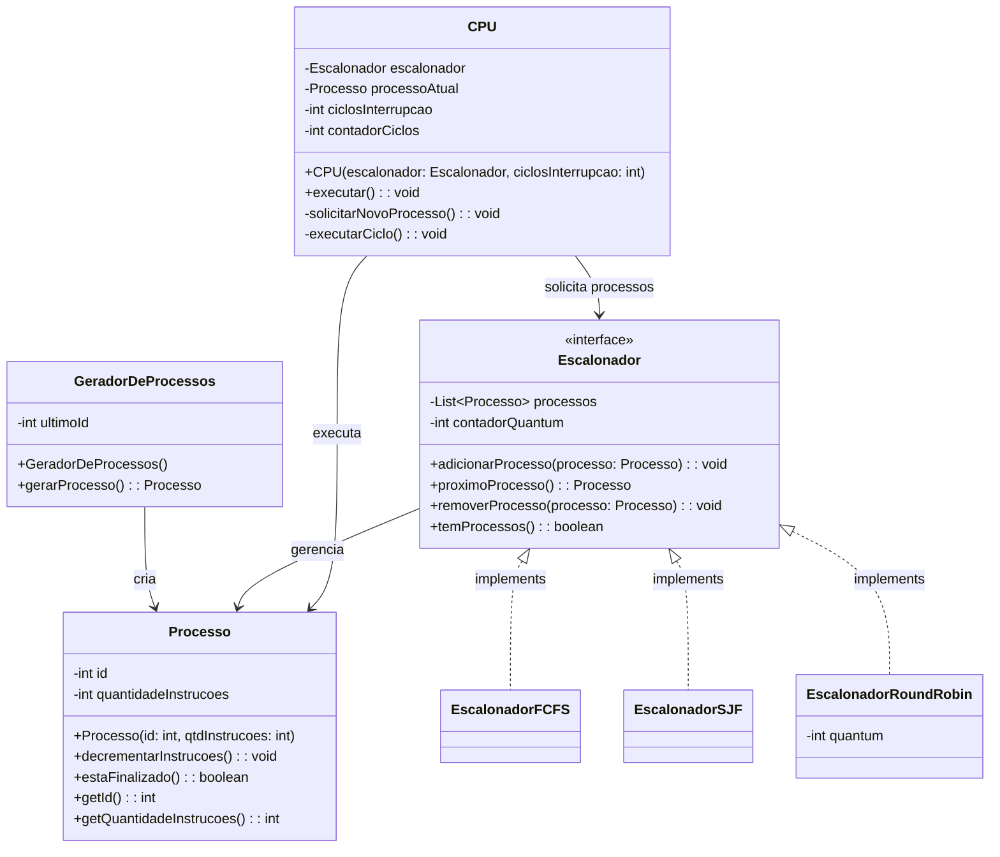
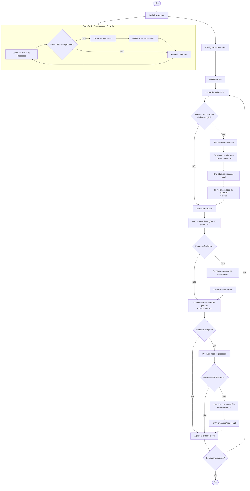

Diagrama de classe

```mermaid
classDiagram
    class Processo {
        -int id
        -int quantidadeInstrucoes
        +Processo(id: int, qtdInstrucoes: int)
        +decrementarInstrucoes(): void
        +estaFinalizado(): boolean
        +getId(): int
        +getQuantidadeInstrucoes(): int
    }

    class GeradorDeProcessos {
        -int ultimoId
        +GeradorDeProcessos()
        +gerarProcesso(): Processo
    }

    class Escalonador {
        <<interface>>
        -List~Processo~ processos
        -int contadorQuantum
        +adicionarProcesso(processo: Processo): void
        +proximoProcesso(): Processo
        +removerProcesso(processo: Processo): void
        +temProcessos(): boolean
    }
    
    class EscalonadorFCFS {
    }
    
    class EscalonadorRoundRobin {
        -int quantum
    }
    
    class EscalonadorSJF {
    }

    class CPU {
        -Escalonador escalonador
        -Processo processoAtual
        -int ciclosInterrupcao
        -int contadorCiclos
        +CPU(escalonador: Escalonador, ciclosInterrupcao: int)
        +executar(): void
        -solicitarNovoProcesso(): void
        -executarCiclo(): void
    }

    GeradorDeProcessos --> Processo : cria
    CPU --> Escalonador : solicita processos
    Escalonador --> Processo : gerencia
    CPU --> Processo : executa
    Escalonador <|.. EscalonadorFCFS: implements
    Escalonador <|.. EscalonadorSJF: implements
    Escalonador <|.. EscalonadorRoundRobin: implements
```

Diagrama de atividade

```mermaid
flowchart TD
    Start([Início]) --> InicializarSistema
    InicializarSistema --> ConfigurarEscalonador
    ConfigurarEscalonador --> InicializarCPU
    InicializarCPU --> MainLoop[Laço Principal da CPU]

    MainLoop --> VerificarInterrupcao{Verificar necessidade\n de interrupção?}

    VerificarInterrupcao -->|Sim| SolicitarNovoProcesso
    VerificarInterrupcao -->|Não| ExecutarInstrucao

    SolicitarNovoProcesso --> EscalonadorProximo[Escalonador seleciona\n próximo processo]
    EscalonadorProximo --> AtualizarProcessoCPU[CPU atualiza processo atual]
    AtualizarProcessoCPU --> ReiniciarContadores[Reiniciar contador de quantum<br>e ciclos]
    ReiniciarContadores --> ExecutarInstrucao

    ExecutarInstrucao --> DecrementarInstrucoes[Decrementar instruções do processo]
    DecrementarInstrucoes --> VerificarProcessoFinalizado{Processo finalizado?}

    VerificarProcessoFinalizado -->|Sim| RemoverProcesso[Remover processo do escalonador]
    VerificarProcessoFinalizado -->|Não| IncrementarContadores[Incrementar contador de quantum<br>e ciclos de CPU]

    RemoverProcesso --> LimparProcessoAtual
    LimparProcessoAtual --> IncrementarContadores

    IncrementarContadores --> VerificarQuantum{Quantum atingido?}

    VerificarQuantum -->|Sim| PrepararTrocaProcesso[Preparar troca de processo]
    VerificarQuantum -->|Não| Sleep[Aguardar ciclo de clock]

    PrepararTrocaProcesso --> DevolverProcessoFila{Processo não finalizado?}
    DevolverProcessoFila -->|Sim| DevolverFila[Devolver processo à fila<br>do escalonador]
    DevolverProcessoFila -->|Não| Sleep
    DevolverFila --> LimparProcessoCPU[CPU: processoAtual = null]
    LimparProcessoCPU --> Sleep

    Sleep --> VerificarContinuação{Continuar execução?}

    VerificarContinuação -->|Sim| MainLoop
    VerificarContinuação -->|Não| End([Fim])

%% Processos paralelos
    subgraph ProcessoParalelo [Geração de Processos em Paralelo]
        GeradorLoop[Laço do Gerador de Processos]
        GeradorLoop --> VerificarNecessidadeProcesso{Necessário novo processo?}
        VerificarNecessidadeProcesso -->|Sim| GerarNovoProcesso[Gerar novo processo]
        GerarNovoProcesso --> AdicionarAoEscalonador[Adicionar ao escalonador]
        AdicionarAoEscalonador --> SleepGerador[Aguardar intervalo]
        VerificarNecessidadeProcesso -->|Não| SleepGerador
        SleepGerador --> GeradorLoop
    end

    InicializarSistema --> ProcessoParalelo
```